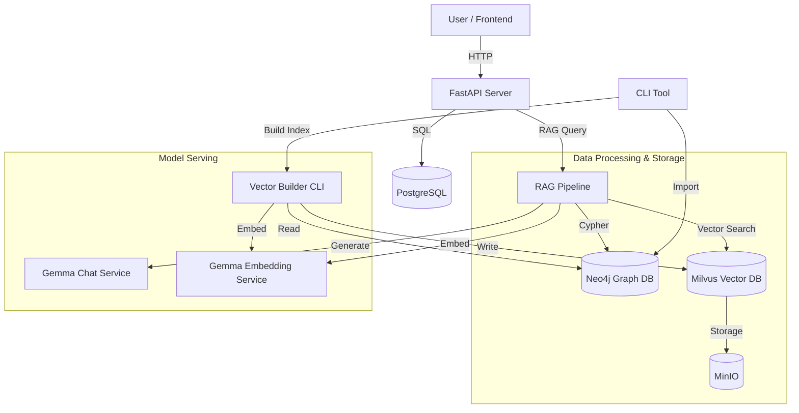

# Software Engineering Documentation

## 1. Architectural Overview

The PMLLM system is designed as a **Retrieval-Augmented Generation (RAG)** application that integrates structured knowledge (Knowledge Graph) with unstructured semantic understanding (Vector Database).

### High-Level Architecture

The system follows a **Microservices-based** architecture for the runtime environment, complemented by a **CLI-based** pipeline for data engineering.

- **Frontend**: React Application (Client-side).
- **Backend API**: FastAPI service (`pmllm-recommender-api`).
- **Data Stores**:
    - **Neo4j**: Graph Database (Logical Brain).
    - **Milvus**: Vector Database (Intuitive Brain).
    - **PostgreSQL**: Relational Database (User Data & Chat History).
    - **MinIO**: Object Storage (Milvus dependency).
- **Model Serving**:
    - **Gemma Chat**: LLM serving container (`llama.cpp`).
    - **Gemma Embeddings**: Embedding model serving container (`llama.cpp`).

### Component Diagram

## 2. Core Workflows & Activity Diagrams

### 2.1. Data Ingestion Pipeline (ETL)

The data ingestion process transforms raw MusicBrainz dumps into a queryable Knowledge Graph.

**Flow:**
1.  **Extraction**: Read raw TSV/TAR files.
2.  **Transformation**:
    - Convert TSV to CSV.
    - Clean and normalize data.
    - Map entities to Graph Nodes (Artist, Recording, Release, etc.).
    - Map relationships (Artist-Recording, etc.).
3.  **Loading**: Bulk import into Neo4j using `neo4j-admin database import`.

**Key Engineering Decision**:
- Use of **Multiprocessing** in `build_vector_db.py` to handle large datasets efficiently.
- **Deterministic Sampling** (`elementId % MOD_BASE`) to create consistent subsets for testing.

### 2.2. Vector Index Construction

Once the Graph is built, we construct the Vector Index to enable semantic search.

**Flow:**
1.  **Fetch**: Iterate through Neo4j nodes (Artists, Works, etc.).
2.  **Textualization**: Convert node properties and relationships into a rich text description (e.g., "The Beatles are a Rock band from Liverpool...").
3.  **Embedding**: Send text to `gemma-embeddings` service to get vector representations.
4.  **Indexing**: Insert vectors into Milvus.

**Key Engineering Decision**:
- **Batch Processing**: Embeddings are generated in batches to maximize GPU/CPU throughput.
- **Fallback Mechanism**: If batch fails, retry sequentially.

### 2.3. RAG Query Execution

The runtime query process combines both databases.

**Flow:**
1.  **User Query**: "Recommend me 80s rock bands similar to Queen."
2.  **Intent Analysis**: (Optional) Determine if query is factual or exploratory.
3.  **Retrieval**:
    - **Vector Search (Milvus)**: Find semantically similar entities.
    - **Graph Traversal (Neo4j)**: Find connected entities (e.g., "Bands in same genre", "Collaborators").
4.  **Context Assembly**: Combine retrieved data into a prompt context.
5.  **Generation**: Send Prompt + Context to `gemma-chat`.
6.  **Response**: Return natural language answer to user.

## 3. Software Design Patterns

- **Repository Pattern**: Used in `db/neo4j/neo4j_handler.py` and `db/vector/milvus_store.py` to abstract database operations.
- **Factory Pattern**: Implicitly used in `utils/data_builder.py` to create different data processors based on entity type.
- **Pipeline Pattern**: The RAG process is a pipeline of distinct steps (Retrieve -> Augment -> Generate).
- **Singleton**: Database connections (Neo4j driver, Milvus connection) are managed as singletons to prevent connection leaks.

## 4. Technology Stack & Rationale

| Component | Technology | Rationale |
|-----------|------------|-----------|
| **Language** | Python 3.10+ | Rich ecosystem for AI/ML and Data Engineering. |
| **Web Framework** | FastAPI | High performance, async support, auto-documentation (Swagger). |
| **Graph DB** | Neo4j | Industry standard for graph data, powerful Cypher query language. |
| **Vector DB** | Milvus | Scalable, cloud-native vector database. |
| **LLM Serving** | llama.cpp | Efficient inference on consumer hardware (CPU/GPU). |
| **Package Mgr** | uv | Extremely fast dependency management and virtualenv creation. |
| **CLI** | Typer | Easy to build robust CLI tools with type hints. |

## 5. Directory Structure & Modules

- `db/`: Database abstraction layers.
    - `neo4j/`: Graph operations.
    - `vector/`: Vector operations and RAG logic.
- `server/`: API implementation.
- `utils/`: Shared utilities (File I/O, String manipulation).
- `model_gateway/`: (Legacy/Alternative) Python wrapper for models, now largely superseded by direct `llama.cpp` containers.
- `scripts/`: Testing and maintenance scripts.

## 6. Error Handling & Logging

- **Global Exception Handling**: The API uses FastAPI's exception handlers to return standardized error responses.
- **Retry Logic**: Network calls to Model Gateway include exponential backoff retries.
- **Logging**: Structured logging is used to track pipeline progress and runtime errors.
