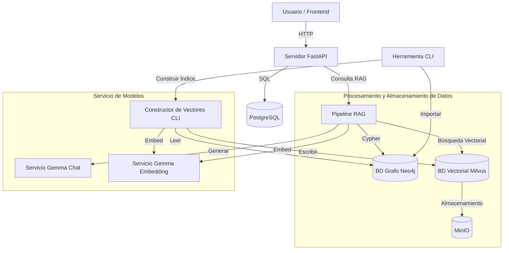

# Documentación de Ingeniería de Software

## 1. Visión General de la Arquitectura

El sistema PMLLM está diseñado como una aplicación de **Generación Aumentada por Recuperación (RAG)** que integra conocimiento estructurado (Grafo de Conocimiento) con comprensión semántica no estructurada (Base de Datos Vectorial).

### Arquitectura de Alto Nivel

El sistema sigue una arquitectura basada en **Microservicios** para el entorno de ejecución, complementada por un pipeline basado en **CLI** para la ingeniería de datos.

- **Frontend**: Aplicación React (Lado del cliente).
- **Backend API**: Servicio FastAPI (`pmllm-recommender-api`).
- **Almacenes de Datos**:
    - **Neo4j**: Base de Datos de Grafos (Cerebro Lógico).
    - **Milvus**: Base de Datos Vectorial (Cerebro Intuitivo).
    - **PostgreSQL**: Base de Datos Relacional (Datos de Usuario e Historial de Chat).
    - **MinIO**: Almacenamiento de Objetos (Dependencia de Milvus).
- **Servicio de Modelos**:
    - **Gemma Chat**: Contenedor de servicio LLM (`llama.cpp`).
    - **Gemma Embeddings**: Contenedor de servicio de modelos de embedding (`llama.cpp`).

### Diagrama de Componentes

## 2. Flujos Principales y Diagramas de Actividad

### 2.1. Pipeline de Ingesta de Datos (ETL)

El proceso de ingesta de datos transforma los volcados brutos de MusicBrainz en un Grafo de Conocimiento consultable.

**Flujo:**
1.  **Extracción**: Leer archivos TSV/TAR brutos.
2.  **Transformación**:
    - Convertir TSV a CSV.
    - Limpiar y normalizar datos.
    - Mapear entidades a Nodos del Grafo (Artista, Grabación, Lanzamiento, etc.).
    - Mapear relaciones (Artista-Grabación, etc.).
3.  **Carga**: Importación masiva en Neo4j usando `neo4j-admin database import`.

**Decisión de Ingeniería Clave**:
- Uso de **Multiprocesamiento** en `build_vector_db.py` para manejar grandes conjuntos de datos eficientemente.
- **Muestreo Determinista** (`elementId % MOD_BASE`) para crear subconjuntos consistentes para pruebas.

### 2.2. Construcción del Índice Vectorial

Una vez construido el Grafo, construimos el Índice Vectorial para permitir la búsqueda semántica.

**Flujo:**
1.  **Obtención**: Iterar a través de los nodos de Neo4j (Artistas, Obras, etc.).
2.  **Textualización**: Convertir propiedades de nodos y relaciones en una descripción de texto rica (ej. "The Beatles son una banda de Rock de Liverpool...").
3.  **Embedding**: Enviar texto al servicio `gemma-embeddings` para obtener representaciones vectoriales.
4.  **Indexación**: Insertar vectores en Milvus.

**Decisión de Ingeniería Clave**:
- **Procesamiento por Lotes**: Los embeddings se generan en lotes para maximizar el rendimiento de GPU/CPU.
- **Mecanismo de Respaldo**: Si el lote falla, reintentar secuencialmente.

### 2.3. Ejecución de Consulta RAG

El proceso de consulta en tiempo de ejecución combina ambas bases de datos.

**Flujo:**
1.  **Consulta de Usuario**: "Recomiéndame bandas de rock de los 80 similares a Queen."
2.  **Análisis de Intención**: (Opcional) Determinar si la consulta es factual o exploratoria.
3.  **Recuperación**:
    - **Búsqueda Vectorial (Milvus)**: Encontrar entidades semánticamente similares.
    - **Recorrido de Grafo (Neo4j)**: Encontrar entidades conectadas (ej. "Bandas en el mismo género", "Colaboradores").
4.  **Ensamblaje de Contexto**: Combinar datos recuperados en un contexto para el prompt.
5.  **Generación**: Enviar Prompt + Contexto a `gemma-chat`.
6.  **Respuesta**: Devolver respuesta en lenguaje natural al usuario.

## 3. Patrones de Diseño de Software

- **Patrón Repositorio**: Usado en `db/neo4j/neo4j_handler.py` y `db/vector/milvus_store.py` para abstraer operaciones de base de datos.
- **Patrón Fábrica**: Usado implícitamente en `utils/data_builder.py` para crear diferentes procesadores de datos según el tipo de entidad.
- **Patrón Pipeline**: El proceso RAG es un pipeline de pasos distintos (Recuperar -> Aumentar -> Generar).
- **Singleton**: Las conexiones a bases de datos (driver Neo4j, conexión Milvus) se gestionan como singletons para prevenir fugas de conexión.

## 4. Stack Tecnológico y Racional

| Componente | Tecnología | Racional |
|------------|------------|----------|
| **Lenguaje** | Python 3.10+ | Rico ecosistema para IA/ML e Ingeniería de Datos. |
| **Framework Web** | FastAPI | Alto rendimiento, soporte asíncrono, auto-documentación (Swagger). |
| **BD Grafo** | Neo4j | Estándar de la industria para datos de grafos, potente lenguaje de consulta Cypher. |
| **BD Vectorial** | Milvus | Base de datos vectorial escalable y nativa de la nube. |
| **Servicio LLM** | llama.cpp | Inferencia eficiente en hardware de consumo (CPU/GPU). |
| **Gestor Paquetes** | uv | Gestión de dependencias y creación de virtualenv extremadamente rápida. |
| **CLI** | Typer | Fácil para construir herramientas CLI robustas con sugerencias de tipo. |

## 5. Estructura de Directorios y Módulos

- `db/`: Capas de abstracción de base de datos.
    - `neo4j/`: Operaciones de grafos.
    - `vector/`: Operaciones vectoriales y lógica RAG.
- `server/`: Implementación de la API.
- `utils/`: Utilidades compartidas (E/S de archivos, manipulación de cadenas).
- `model_gateway/`: (Legado/Alternativo) Envoltorio Python para modelos, ahora mayormente reemplazado por contenedores directos `llama.cpp`.
- `scripts/`: Scripts de prueba y mantenimiento.

## 6. Manejo de Errores y Logging

- **Manejo Global de Excepciones**: La API usa manejadores de excepciones de FastAPI para devolver respuestas de error estandarizadas.
- **Lógica de Reintento**: Las llamadas de red al Gateway de Modelos incluyen reintentos con espera exponencial.
- **Logging**: Se usa logging estructurado para rastrear el progreso del pipeline y errores en tiempo de ejecución.
